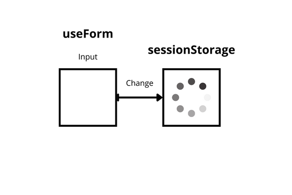
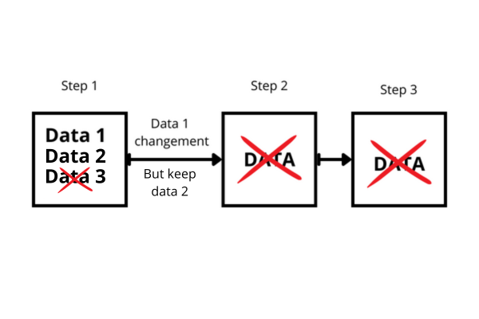

# Formulaire playground

L'idée de ce projet est d'être un bac à sable autour d'un projet utilisant `react-hook-form` et devant persister ces données en `sessionStorage`.

Nous allons essayer de trouver un bon mix entre simplicité et évolutivé/flexibilité.

## Règles à respecter

Voici la liste des règles à respecter :

- Règle 1 : une synchronisation constante des données entre les formulaires `useForm` et la persistence `sessionStorage`.

- Règle 2 : cas nominal - lorsqu'un input change toutes les valeurs d'input des étapes suivantes sont supprimées et celles postérieures de l'étape actuelle également.

- Règle 3 : cas différent - lorsqu'un input change on procède à la règle deux mais pas pour certains champs que l'on souhaite garder.

- Règle 4 : Pas d'affichage du bouton étape suivante si les conditions d'un formulaire d epage n'est pas rempli.

- Règle 5 : Gérer la possibilité de valider à l'intérieur d'un formulaire une donnée avant l'affichage du reste des inputs.

- Règle 6 : Gérer le dynamisme des formulaires suivants les données en entrée, aspect de conditionnement d'affichage.

